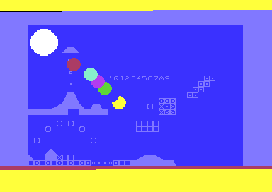
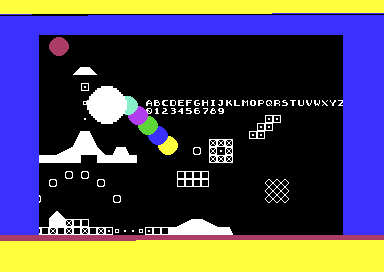
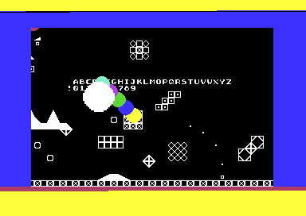
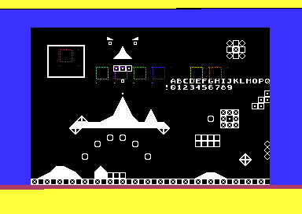
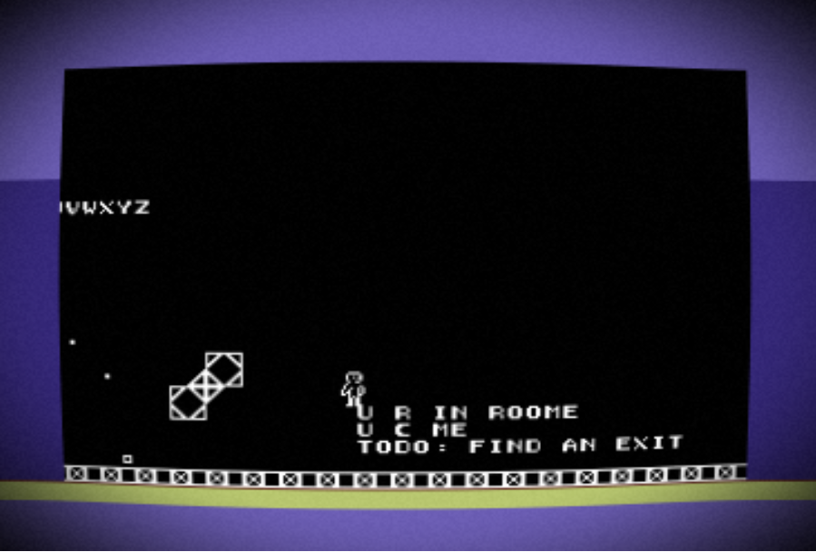

# c64

experiments with bare metal commodore 64

## intention

* horizontal smooth scrolling tile map
* edit tile map with tiled
* user defined character set in png bitmap
* sprites defined in png bitmap
* control scroll by user
* sprites with collision detection
* miniature game with 15 minutes playtime

## tools

* `vice 3.9`: emulation
* `cl65 2.18`: assembler, compiler, linker
* `tiled 1.11.2`: tile map editor
* `gimp 3.0.6`: image manipulation
* `python 3.13.11`: automation

## howto

* use joystick on port 2 to scroll tile map left or right one pixel per frame

## screenshots

