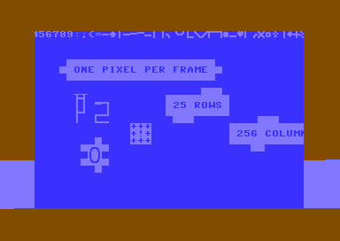
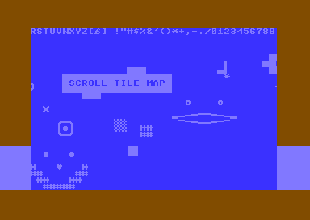
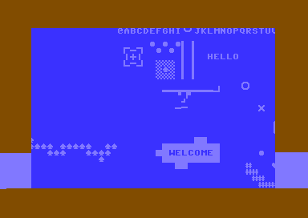

# c64

experiments with bare metal commodore 64

## intention

* horizontal smooth scrolling tile map
* edit tile map with tiled
* control scroll with keyboard
* sprites with collision detection

## howto

* use joystick on port 2 to scroll tile map left or right one pixel per frame

## screenshots

