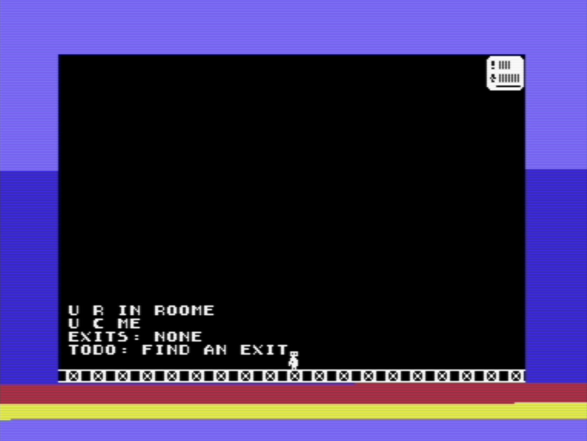

# c64

experiments with bare metal commodore 64

## intention

* horizontal smooth scrolling tile map
* edit tile map with tiled
* user defined character set in png bitmap
* sprites defined in png bitmap
* sprites with collision detection
* miniature game with 15 minutes playtime

## tools

* `vice 3.9`: emulation
* `cl65 2.18`: assembler, compiler, linker
* `tiled 1.11.2`: tile map editor
* `gimp 3.0.6`: image manipulation
* `python 3.13.11`: automation

## howto

* use joystick on port 2 and "return" key
* snapshots of binary can be found in `/snapshots`
* compile and run using `run.sh` on linux and `run.bat` on windows
  * *note*: requires dependencies

## notes

* releases are considered finished
* tagged versions have been played through to completion
* committed is latest in development code

## screenshots

## conclusion

### 1. initial approach

* **attempt:** used a double-buffered screen with shadow sprite structures and
  bottom-border interrupts for screen swapping
* **simplification:** replaced interrupts with busy-wait for the bottom border;
  removed shadow sprite structures; updated sprite states during border regions
  to avoid visual artifacts; removed double buffering for accurate collision
  detection; full unrolled loops of screen update every frame

### 2. tile map rendering

* **full-screen refresh:** abandoned "dirty-tile" rendering in favor of a
  full-screen redraw every frame ensuring a deterministic cycle budget and
  preventing stuttering during a full redraw
* **side-effect:** since the entire screen is refreshed, individual tile update
  logic was removed

### 3. the raster race

* **first try:** using a loop for rows and loop for columns using indirect
  addressing was too slow for 50 Hz performance goal
* **second try:** column based rendering with generated code for rendering of
  the rows
* **problem:** the raster beam outpaced the CPU, rendering the end of a row
  before the CPU could finish updating it (last column rendered last for all
  rows)
* **solution:** implemented a row-based unroll of every tile
* **impact:** allows the CPU to be "chased" by the raster row-by-row freeing
  ~5000 extra cycles for the "update" phase but using ~7 KB

### 4. collision detection

* **double buffer:** removed double buffering because it caused a one-frame lag
  in hardware sprite-to-background collision detection
* **single buffer:** since rendering of the tile map can start a few scanlines
  before the visible area, "chasing the beam", double buffering has no apparent
  use
* **alignment:** background and sprite states are now processed in the same
  frame ensuring the collision state is current and preventing the hero from
  getting stuck in the background without escape
* **escape logic:** implemented a horizontal movement boost applied when hero is
  in collision state due to animation frames allowing the hero to escape
  collision

## 5. performance

* **tile map renderer:** 10,025 cycles.
* **updated budget:** ~5,000 more free cycles for game logic during the "update"
  phase before the raster outpaces the renderer
* **discarded option**: self modifying code is more expensive when rendering a
  full screen
